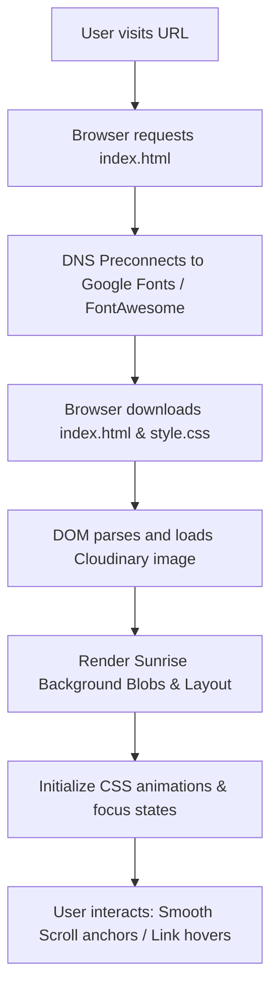

# Aman Chapadiya — Personal Portfolio

A premium, modern, and highly responsive personal portfolio website showcasing the technical skills, featured projects, and professional background of Aman Chapadiya, a Software Developer specializing in frontend engineering, full-stack systems, and clean UI/UX designs.

---

### Project Header Banner
> [!NOTE]
> **Suggested Banner placement:** Place a high-quality mockup banner (e.g., `banner.png` showing the desktop, tablet, and mobile views side-by-side) in `/assets/banner.png` and reference it here:
>
> ``

---

## Badges

[](LICENSE)
[](https://github.com/obscure-01/Portfolio/stargazers)
[](https://github.com/obscure-01/Portfolio/network/members)
[](https://github.com/obscure-01/Portfolio/issues)
[](https://github.com/obscure-01/Portfolio/commits/main)
[](https://developer.mozilla.org/en-US/docs/Glossary/HTML5)
[](https://developer.mozilla.org/en-US/docs/Web/CSS)
[](https://developer.mozilla.org/en-US/docs/Web/JavaScript)
[](#responsive-design)
[](#)
[](#live-demo)

---

## Table of Contents

- [Overview](#overview)
- [Live Demo](#live-demo)
- [Features](#features)
- [Screenshots & Visuals](#screenshots--visuals)
- [Tech Stack](#tech-stack)
- [Architecture & Design System](#architecture--design-system)
- [Folder Structure](#folder-structure)
- [Installation & Local Setup](#installation--local-setup)
- [Environment Variables](#environment-variables)
- [Scripts](#scripts)
- [Performance & Optimization](#performance--optimization)
- [Accessibility](#accessibility)
- [Responsive Design](#responsive-design)
- [Deployment](#deployment)
- [Project Workflow](#project-workflow)
- [Code Quality & Conventions](#code-quality--conventions)
- [Future Improvements](#future-improvements)
- [Contributing](#contributing)
- [License](#license)
- [Author](#author)
- [Acknowledgements](#acknowledgements)

---

## Overview

This project is a high-end, single-page developer portfolio designed to present a clean, elegant, and interactive resume online. 

### Why it exists
In a saturated tech market, developers need a visually stunning, content-focused platform that showcases their work. This portfolio acts as a digital headquarters that instantly communicates competence, design sensibility, and attention to detail.

### Target Audience
- **Recruiters & Hiring Managers** looking for a quick breakdown of skills, roles, and project source links.
- **Tech Collaborators** interested in full-stack architecture, open-source work, and AI tool integrations.
- **Clients** looking to hire freelance full-stack developers.

### Key Objectives
- Deliver a premium, responsive user experience using vanilla web technologies.
- Achieve sub-second page loads with zero-JS dependency execution.
- Showcase specific project identities and frontend design skills through advanced CSS typography, micro-interactions, and visual storytelling.

---

## Live Demo

Explore the live portfolio and its main references:

| Target | URL |
| :--- | :--- |
| **Live Portfolio** | [https://obscure-01.github.io/Portfolio/](https://obscure-01.github.io/Portfolio/) |
| **GitHub Repository** | [https://github.com/obscure-01/Portfolio](https://github.com/obscure-01/Portfolio) |
| **LinkedIn Profile** | [https://www.linkedin.com/in/amanchapadiya/](https://www.linkedin.com/in/amanchapadiya/) |

---

## Features

### UI / UX & Design
- **Sunrise Color Palette:** An HSL/Hex customized color system ranging from warm ivory backgrounds to ocean blue typography and sunset accents.
- **Glassmorphic Navigation:** Sticky header with `backdrop-filter: blur(24px)` that stays visible during scroll with animated bottom-borders on link hover.
- **Visual Accent Blobs:** Fixed-position glowing background blobs with heavy Gaussian blur filters to create depth without affecting page scroll performance.
- **Creative Project Identities:**
  - **ORIGO Card:** Implements a rotating, dashed **Compass Arc** signature element that reacts on hover.
  - **AIris Security Card:** Implements an SVG-rendered **Technical Blueprint Grid** background pattern that activates on card interaction.

### Developer & Structure
- **Optical Balancing Icon System:** Customized class scaling overrides for Devicons and FontAwesome glyphs to normalize visual weight differences.
- **Semantic HTML5:** Strict utilization of outline tags (`<header>`, `<main>`, `<section>`, `<article>`, `<nav>`) rather than arbitrary division nesting.
- **No-Framework Simplicity:** Standard CSS variables, simple anchor routing, and zero overhead JS dependencies for light and quick loading.

### Performance & SEO
- **CDN Asset Delivery:** Loading icons and web fonts from high-availability CDNs (Cloudinary, FontAwesome, Devicon, Google Fonts).
- **DNS Preconnections:** Inclusion of `dns-prefetch` and `preconnect` resource hints to minimize handshake latency.
- **SEO Metadata:** Configured responsive meta viewports, structured titles, and character sets.

---

## Screenshots & Visuals

> [!NOTE]
> **Suggested Screenshot Placements:** To display your portfolio layout, save high-resolution screenshots into the `/assets/` directory and replace the placeholders below.

| Viewport | Preview Link | Description |
| :--- | :--- | :--- |
| **Desktop Preview** | `` | Full wide-screen display showing hero elements and blurred backdrop accents |
| **Tablet Preview** | `` | Medium-width layout showing stacked skill panels and centered navigation |
| **Mobile Preview** | `` | Compact portrait layout with simplified footer details and vertical project buttons |
| **ORIGO Showcase** | `` | Close-up of the ORIGO personal project card showing the custom Compass Arc decoration |
| **AIris Showcase** | `` | Close-up of the AIris Security card highlighting the Blueprint grid pattern |

---

## Tech Stack

| Layer | Technology | Purpose / Detail |
| :--- | :--- | :--- |
| **Core Architecture** | HTML5 | Page structure and semantic layout markup |
| **Styling Engine** | Vanilla CSS3 | Custom variables, flexbox grid, and page theme colors |
| **Typography** | Inter & Poppins | Google Fonts imported for readable text and headings |
| **Vector Icons** | FontAwesome 6.4.0 & Devicon | Scalable icons representing tools, interests, and links |
| **Image Hosting** | Cloudinary | Cloud delivery of optimized, high-fidelity profile images |
| **Deployment** | GitHub Pages / Netlify / Vercel | Hosted platform details (Static files deployment) |

---

## Architecture & Design System

The application uses a lightweight **Static Page Architecture (SPA)** relying entirely on browser native parsing:

```
[User Browser]
      │
      ├─► index.html (Parses DOM Structure & Semantic Layout)
      │      │
      │      ├─► Google Fonts (Imports Inter & Poppins Typography)
      │      ├─► CDN FontAwesome & Devicons (Icon sets)
      │      ├─► Cloudinary (Assets & Profile Image)
      │      │
      │      └─► style.css (Injects layout styles, design tokens & transitions)
```

### Design System Tokens (`style.css`)
- **Theme Variables:** Colors are mapped to semantic CSS custom variables (`:root`).
- **Accent Layering:** Absolute-positioned accent blobs are placed inside a fixed wrapper (`.background-accents`), isolated from document content layout calculations.
- **Transitions:** A uniform transition curve (`0.4s cubic-bezier(0.4, 0, 0.2, 1)`) is declared globally to animate hover elements, card scaling, and button overlays.

---

## Folder Structure

The project maintains a flat, easy-to-understand folder structure designed for static hosting:

```
Portfolio/
├── .git/                     # Git version history directory
├── assets/                   # Site media and assets
│   └── favicon/              # Multiresolution site branding and icons
│       ├── apple-touch-icon.png
│       ├── favicon-16x16.png
│       ├── favicon-32x32.png
│       └── favicon.ico
├── index.html                # Semantic HTML structure, copy, and header link scripts
├── style.css                 # Custom styling layout, animations, and CSS variables
├── LICENSE                   # Open-source MIT License terms
└── README.md                 # Project documentation and specifications
```

---

## Installation & Local Setup

Since this project consists of vanilla HTML and CSS files, there are no dependencies to download or build processes to run. You can run the project using any of the following methods:

### 1. VS Code Live Server (Recommended)
1. Open the project folder in VS Code.
2. Install the **Live Server** extension (by Ritwick Dey).
3. Click the **Go Live** button in the status bar (bottom right).
4. A local page will open automatically at `http://127.0.0.1:5500/index.html`.

### 2. Python HTTP Server
If you have Python installed, launch a local web server from your terminal:
```bash
# Clone the repository
git clone https://github.com/obscure-01/Portfolio.git

# Navigate to directory
cd Portfolio

# Start server
python -m http.server 8000
```
Then open [http://localhost:8000](http://localhost:8000) in your web browser.

### 3. Node.js static server
If you prefer Node.js packages:
```bash
# Install global server utility
npm install -g serve

# Run static files
serve .
```
Then open the page at the local address returned in your terminal.

---

## Environment Variables

This project does not use any environment variables. All static assets and external resources (such as Cloudinary images and font links) are loaded directly via public URLs within the HTML and CSS source files.

---

## Scripts

This project does not contain a `package.json` file or any NPM build scripts. The local development and preview steps rely entirely on the native web server methods mentioned in the [Installation & Local Setup](#installation--local-setup) section.

---

## Performance & Optimization

- **CSS-Only Animations:** Animations are implemented using CSS transitions (`cubic-bezier`) and keyframes, avoiding runtime JavaScript calculations and reducing rendering thread load.
- **Resource Preconnections:** The HTML file preconnects to Google Fonts (`https://fonts.googleapis.com` and `https://fonts.gstatic.com`) to resolve external domain handshakes before fetching styles.
- **Cloud-Optimized Images:** High-resolution assets are served via Cloudinary's content delivery network for fast load times and optimal caching.

---

## Accessibility

- **Custom Focus States:** Interactive items (links, buttons) feature custom `:focus-visible` styling (`outline: 2px solid var(--ocean-blue)`) to ensure high contrast outline rings for keyboard navigators.
- **Screen Reader Support:** Elements like the scroll indicator button are built with descriptive, accessible labels (`aria-label="Scroll down"`).
- **Heading Outline:** Sequential title tags (`<h1>` to `<h4>`) are configured in sequence to support logical parser traversal.
- **Semantic Structure:** Code layout uses HTML5 tags like `<article>` for projects and `<nav>` for navigation links rather than generic layout divs.

---

## Responsive Design

The stylesheet includes design logic handling adjustments at distinct viewport breakpoints:

```
[ Mobile View ] <------- 768px -------> [ Tablet View ] <------- 1024px -------> [ Desktop View ]
   - Center navigation                     - Center navigation                    - Grid layout active
   - Vertical buttons                      - Stacked grid columns                 - Sidebar alignment
   - Large padding reduction               - Scroll indicator hidden              - Full scale elements
```

- **Large screens (Desktop):** Up to `1200px` content container, content uses side-by-side grids, and profile graphics hover alongside text block elements.
- **Medium Screens (Tablets / Laptops):** Breakpoint `@media (max-width: 1024px)` centers the hero section, stacks layout grids vertically, and aligns the main content to the center.
- **Small Screens (Mobile):** Breakpoint `@media (max-width: 768px)` collapses the nav header margins, wraps navigation links into a multi-line list, disables the scroll indicator, and reformats project action buttons into full-width tap targets.

---

## Deployment

The static nature of the project makes it suitable for instant hosting on cloud providers.

### Deploying on Vercel
1. Install the Vercel CLI tool: `npm i -g vercel`.
2. Run `vercel` from the root folder.
3. Keep default build options:
   - **Build Command:** `None` (leave blank / default static)
   - **Output Directory:** `.` (current folder)
4. Confirm to deploy and retrieve your public live link.

### Deploying on Netlify
- Drag and drop the root repository folder onto the Netlify dropzone web console, or connect your Git branch for automated deploys.

---

## Project Workflow

When a user visits the webpage, the following steps execute:



1. **DOM Load:** The browser loads the structure, imports the Montserrat/Poppins fonts, and retrieves normalized vector icons.
2. **Layout Calculation:** The browser engine interprets CSS custom variables to apply colors and layouts, setting fixed blur accent blobs behind content cards.
3. **Micro-interactions:** When hovering or scrolling:
   - Sticky navigation header uses backdrop filters to blur content scrolling underneath.
   - Hovering over ORIGO card rotates the Compass Arc element.
   - Hovering over AIris Security card shifts the Blueprint grid element.
   - Page links use smooth scrolling CSS parameters to navigate to anchor IDs.

---

## Code Quality & Conventions

- **Visual Variables System:** CSS colors, shadows, borders, transitions, and image placements are controlled from a single, centralized `:root` dictionary.
- **Icon Normalization:** Normalizes icons to a standard visual container size (`36px` by `36px`) and balances size issues individually (e.g. scaling up Next.js to `32px` while keeping Java at `26px`).
- **Strict Formatting:** Standard nesting indentations are used in the HTML file, keeping clean markup spacing and consistent attribute ordering.

---

## Future Improvements

- [ ] **Dark Mode Toggle:** Implement a lightweight CSS theme switcher using system color schemes or a manual button control.
- [ ] **Contact Form Endpoint:** Add a serverless contact email form backend integration (e.g., Formspree or Web3Forms).
- [ ] **Interactive Project Category Filter:** Implement simple JavaScript logic to filter project list grids based on technologies (e.g. showing only React or Backend projects).

---

## Contributing

Contributions are welcome to make this portfolio layout even better! Please follow these guidelines:

1. **Fork** the project repository.
2. **Create a Feature Branch** (`git checkout -b feature/AmazingFeature`).
3. **Commit your Changes** (`git commit -m 'Add some AmazingFeature'`).
4. **Push to the Branch** (`git push origin feature/AmazingFeature`).
5. **Open a Pull Request** for review.

---

## License

This project is licensed under the MIT License - see the [LICENSE](LICENSE) file for details.

---

## Author

**Aman Chapadiya**
- **LinkedIn:** [Aman Chapadiya](https://www.linkedin.com/in/amanchapadiya/)
- **GitHub:** [@obscure-01](https://github.com/obscure-01)
- **Email:** [chapadiya.aman@gmail.com](mailto:chapadiya.aman@gmail.com)

---

## Acknowledgements

- [Google Fonts](https://fonts.google.com/) (Inter & Poppins typefaces)
- [FontAwesome](https://fontawesome.com/) (Social media and vector icons)
- [Devicon Project](https://devicon.dev/) (Developer stack technology logos)
- [Shields.io](https://shields.io/) (Status badges)
- [Cloudinary](https://cloudinary.com/) (Optimized hosting of portfolio visual assets)